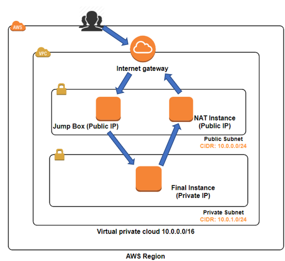
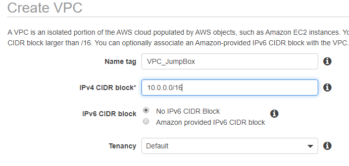
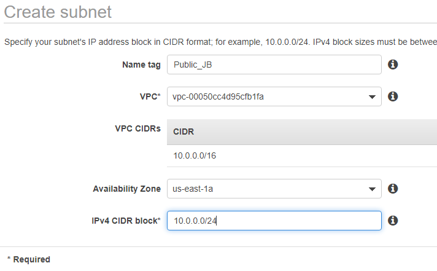
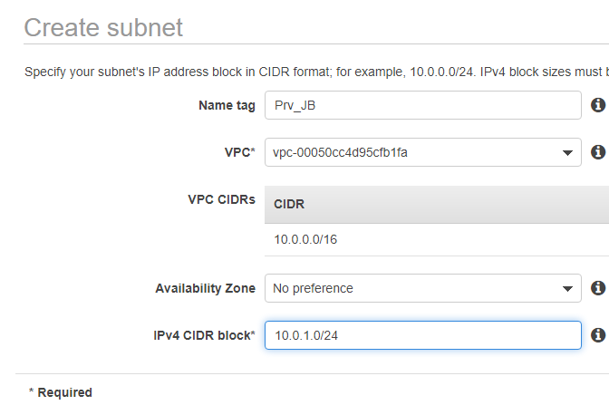

# AWS Networking Tutorial: Private Subnet Internet Access via Jump Box & NAT Instance

## Objective

This tutorial guides you through setting up a secure and functional AWS network environment. You will learn how to:
* Create a Virtual Private Cloud (VPC) with public and private subnets.
* Establish internet connectivity for instances in a private subnet using a NAT instance.
* Securely access private instances via a jump box (bastion host) in the public subnet.
* Verify connectivity by pinging `google.com` from an instance in the private subnet.

This architecture is ideal for deploying application servers or databases that require outbound internet access but should not be directly exposed to the internet.

## Architecture Diagram

The following diagram illustrates the network setup we will be creating:


*Image Description: An overall diagram showing a VPC, divided into a Public and Private Subnet. The Public Subnet contains a Jump Box and a NAT Instance, connected to an Internet Gateway. The Private Subnet contains a Final Instance, with an arrow pointing to the NAT Instance for outbound traffic. Arrows show SSH access from the internet to the Jump Box, then to the Final Instance.*

## Prerequisites

* An active AWS account.
* Basic understanding of AWS VPC, EC2, and Security Groups.
* SSH client (e.g., PuTTY for Windows, or `ssh` command for Linux/macOS/WSL).
* PuTTYgen and Pageant (if using PuTTY for SSH key management).

## Tutorial Steps Overview

Here's a high-level overview of the steps we will follow:

1.  **Create VPC:** Set up your isolated network environment.
2.  **Create Subnets:** Define public and private network segments within your VPC.
3.  **Create Internet Gateway (IGW):** Enable internet communication for the public subnet.
4.  **Configure Route Tables:** Define traffic routing rules for both public and private subnets.
5.  **Create Security Groups:** Implement firewall rules for your instances.
6.  **Launch EC2 Instances:** Deploy the Jump Box, NAT Instance, and Final Instance.
7.  **Associate Elastic IPs:** Assign static public IP addresses for the Jump Box and NAT Instance.
8.  **Test Connectivity:** Verify SSH access and internet connectivity from the private instance.

---

## Step-by-Step Tutorial

### Step 1: Create Your Virtual Private Cloud (VPC)

The VPC will serve as your isolated virtual network in AWS.

1.  Navigate to the AWS Management Console.
2.  In the search bar, type "VPC" and select **VPC** under Services.
3.  In the VPC Dashboard, click on **"Your VPCs"** in the left navigation pane.
4.  Click the **"Create VPC"** button.
5.  **Name tag:** Enter a descriptive name (e.g., `MyCustomVPC`).
6.  **IPv4 CIDR block:** Enter `10.0.0.0/16` (This CIDR block allows for 65,536 private IP addresses).
    * *No other changes are needed for this step.*
7.  Click **"Create VPC"**.


*Image Description: A screenshot of the AWS "Create VPC" console page, showing the Name tag and IPv4 CIDR block fields filled in with `10.0.0.0/16`.*

### Step 2: Create Public and Private Subnets

You will create two subnets within your VPC: one public (for internet-facing resources like the Jump Box and NAT Instance) and one private (for backend resources like your Final Instance).

1.  From the VPC Dashboard, click **"Subnets"** in the left navigation pane.
2.  Click the **"Create subnet"** button.
3.  **VPC ID:** Select the VPC you created in Step 1 (e.g., `MyCustomVPC`).

4.  **Create the Public Subnet:**
    * **Subnet name:** Enter `Public-Subnet`.
    * **Availability Zone:** Choose an Availability Zone (e.g., `us-east-1a`).
    * **IPv4 CIDR block:** Enter `10.0.0.0/24`.
    * Click **"Create subnet"**.

    
    *Image Description: A screenshot of the AWS "Create subnet" console page, showing the VPC ID selected, Subnet name as `Public-Subnet`, and IPv4 CIDR block as `10.0.0.0/24`.*

5.  **Create the Private Subnet:**
    * Click the **"Create subnet"** button again.
    * **VPC ID:** Select your VPC (`MyCustomVPC`).
    * **Subnet name:** Enter `Private-Subnet`.
    * **Availability Zone:** Choose the *same* Availability Zone as your public subnet (e.g., `us-east-1a`).
    * **IPv4 CIDR block:** Enter `10.0.1.0/24`.
    * Click **"Create subnet"**.

    
    *Image Description: A screenshot of the AWS "Create subnet" console page, showing the VPC ID selected, Subnet name as `Private-Subnet`, and IPv4 CIDR block as `10.0.1.0/24`.*

---

### Step 3: Create an Internet Gateway (IGW)

The Internet Gateway enables communication between your VPC and the internet. It needs to be attached to your VPC.

1.  From the VPC Dashboard, click **"Internet Gateways"** in the left navigation pane.
2.  Click **"Create internet gateway"**.
3.  **Name tag:** Enter a name (e.g., `MyCustomVPC-IGW`).
4.  Click **"Create internet gateway"**.


*Image Description: A screenshot of the AWS "Create internet gateway" console page, with the Name tag field filled in.*

5.  After creation, select your new Internet Gateway.
6.  Click **"Actions"** and then **"Attach to VPC"**.
7.  Select your VPC (`MyCustomVPC`) from the dropdown and click **"Attach internet gateway"**.


*Image Description: A screenshot of the AWS console showing the "Attach to VPC" dialog for an Internet Gateway, with the correct VPC selected in the dropdown.*

### Step 4: Configure Route Tables

You need two route tables: one for the public subnet (to direct internet traffic to the IGW) and one for the private subnet (to direct internet traffic to the NAT instance later).

#### 4.1. Public Route Table

1.  From the VPC Dashboard, click **"Route Tables"** in the left navigation pane.
2.  Click **"Create route table"**.
3.  **Name tag:** Enter `Public-Route-Table`.
4.  **VPC:** Select your VPC (`MyCustomVPC`).
5.  Click **"Create route table"**.


*Image Description: A screenshot of the AWS "Create route table" console page, with the Name tag and VPC selected.*

6.  Select your newly created `Public-Route-Table`.
7.  Go to the **"Routes"** tab.
8.  Click **"Edit routes"** and then **"Add route"**.
    * **Destination:** `0.0.0.0/0` (This means "all internet traffic").
    * **Target:** Select **"Internet Gateway"** and choose your `MyCustomVPC-IGW`.


*Image Description: A screenshot of the AWS Route Table "Routes" tab, showing the "Add route" dialog with `0.0.0.0/0` as destination and the Internet Gateway as target.*

9.  Click **"Save changes"**.
10. Go to the **"Subnet associations"** tab.
11. Click **"Edit subnet associations"**.
12. Select your **`Public-Subnet`** and click **"Save associations"**.


*Image Description: A screenshot of the AWS Route Table "Subnet associations" tab, showing the Public-Subnet selected for association.*

#### 4.2. Private Route Table

1.  From the VPC Dashboard, click **"Route Tables"** in the left navigation pane.
2.  Click **"Create route table"**.
3.  **Name tag:** Enter `Private-Route-Table`.
4.  **VPC:** Select your VPC (`MyCustomVPC`).
5.  Click **"Create route table"**.


*Image Description: A screenshot of the AWS "Create route table" console page, with the Name tag and VPC selected for the private route table.*

6.  Select your newly created `Private-Route-Table`.
7.  Go to the **"Subnet associations"** tab.
8.  Click **"Edit subnet associations"**.
9.  Select your **`Private-Subnet`** and click **"Save associations"**.
    * *We will add the route to the NAT Instance in this table after launching the NAT Instance.*


*Image Description: A screenshot of the AWS Route Table "Subnet associations" tab, showing the Private-Subnet selected for association.*

### Step 5: Create Security Groups

Security groups act as virtual firewalls for your instances. You will create three: one for the Jump Box, one for the NAT Instance, and one for the Final Instance.

1.  Navigate to the EC2 Dashboard.
2.  In the left navigation pane, scroll down to "Network & Security" and click **"Security Groups"**.
3.  Click the **"Create security group"** button.

#### 5.1. Jump Box Security Group (`SG-JumpBox`)

This SG allows SSH access from your IP and outbound internet access.

1.  **Security group name:** `SG-JumpBox`
2.  **Description:** `Security Group for Jump Box`
3.  **VPC:** Select your `MyCustomVPC`.
4.  **Inbound rules:**
    * Click **"Add rule"**.
    * **Type:** `SSH`
    * **Source:** `My IP` (This automatically detects your public IP. For better security, you could specify your exact public IP address range).
5.  **Outbound rules:**
    * (Default) **Type:** `All traffic`, **Destination:** `0.0.0.0/0` (Allows all outbound traffic, which is fine for a jump box).
6.  Click **"Create security group"**.


*Image Description: A screenshot of the AWS "Create security group" console page, showing the Inbound rules section configured for SSH from My IP.*

#### 5.2. NAT Instance Security Group (`SG-NAT`)

This SG allows inbound HTTP/HTTPS (for updates if needed) and SSH from the public subnet, and traffic forwarding from the private subnet.

1.  **Security group name:** `SG-NAT`
2.  **Description:** `Security Group for NAT Instance`
3.  **VPC:** Select your `MyCustomVPC`.
4.  **Inbound rules:**
    * Click **"Add rule"**. **Type:** `SSH`, **Source:** `MyCustomVPC`'s CIDR (`10.0.0.0/16`)
    * Click **"Add rule"**. **Type:** `HTTP`, **Source:** `MyCustomVPC`'s CIDR (`10.0.0.0/16`)
    * Click **"Add rule"**. **Type:** `HTTPS`, **Source:** `MyCustomVPC`'s CIDR (`10.0.0.0/16`)
5.  **Outbound rules:**
    * (Default) **Type:** `All traffic`, **Destination:** `0.0.0.0/0` (Allows all outbound traffic).
6.  Click **"Create security group"**.


*Image Description: A screenshot of the AWS "Create security group" console page, showing Inbound rules for SSH, HTTP, HTTPS with source as the VPC CIDR (10.0.0.0/16).*

#### 5.3. Final Instance Security Group (`SG-FinalInstance`)

This SG allows SSH access *only* from the Jump Box's security group and outbound internet access to the NAT instance.

1.  **Security group name:** `SG-FinalInstance`
2.  **Description:** `Security Group for Final Instance in Private Subnet`
3.  **VPC:** Select your `MyCustomVPC`.
4.  **Inbound rules:**
    * Click **"Add rule"**.
    * **Type:** `SSH`
    * **Source:** Select the `SG-JumpBox` security group ID from the dropdown (this allows only instances associated with `SG-JumpBox` to SSH).
    * *Optional:* Add `All ICMP - IPv4` from `10.0.0.0/16` for testing `ping` connectivity within the VPC.
5.  **Outbound rules:**
    * Click **"Add rule"**.
    * **Type:** `All traffic`
    * **Destination:** Select the `SG-NAT` security group ID from the dropdown (this allows the final instance to send all its outbound traffic to the NAT instance).
    * *Alternatively, you could specify the private IP of the NAT instance here once it's launched.*
6.  Click **"Create security group"**.


*Image Description: A screenshot of the AWS "Create security group" console page, showing Inbound rule for SSH with source as the SG-JumpBox security group ID. Also, Outbound rule showing All traffic to the SG-NAT security group ID.*

### Step 6: Launch EC2 Instances

You will launch three EC2 instances: the Jump Box and NAT Instance in the public subnet, and the Final Instance in the private subnet.

1.  Navigate to the EC2 Dashboard.
2.  In the left navigation pane, click **"Instances"**.
3.  Click **"Launch instances"**.

#### 6.1. Launch Jump Box Instance

1.  **Name:** `JumpBox`
2.  **Application and OS Images (AMI):** Select `Amazon Linux 2023 AMI` (or Amazon Linux 2 AMI).
3.  **Instance type:** `t2.micro` (free tier eligible).
4.  **Key pair (login):**
    * Choose an existing key pair or create a new one. Download the `.pem` file and keep it secure. You'll need it for SSH.
5.  **Network settings:**
    * Click **"Edit"**.
    * **VPC:** Select `MyCustomVPC`.
    * **Subnet:** Select `Public-Subnet`.
    * **Auto-assign public IP:** **Enable** (Important for initial SSH access).
    * **Firewall (security groups):** Select **"Select existing security group"** and choose `SG-JumpBox`.
6.  **Summary:** Review your settings.
7.  Click **"Launch instance"**.


*Image Description: A screenshot of the AWS EC2 "Launch an instance" page, showing the configuration for the JumpBox: Name, AMI, Instance Type, Key Pair, Network Settings (VPC, Public Subnet, Auto-assign Public IP enabled, SG-JumpBox selected).*

#### 6.2. Launch NAT Instance

1.  **Name:** `NAT-Instance`
2.  **Application and OS Images (AMI):** Search for and select **"NAT Instance"** in the AWS Marketplace. Choose an AMI published by Amazon for NAT. (e.g., `amzn-ami-vpc-nat-hvm-2018.03.0.x86_64-ecs-pv (ami-0e1c9e83712b7a957)`)
    * *Note: Using a dedicated NAT Gateway is generally recommended for production, but a NAT instance is used here for tutorial purposes.*
3.  **Instance type:** `t2.micro` (free tier eligible if applicable for the chosen NAT AMI).
4.  **Key pair (login):** Use the *same* key pair as your Jump Box.
5.  **Network settings:**
    * Click **"Edit"**.
    * **VPC:** Select `MyCustomVPC`.
    * **Subnet:** Select `Public-Subnet`.
    * **Auto-assign public IP:** **Enable**.
    * **Firewall (security groups):** Select **"Select existing security group"** and choose `SG-NAT`.
6.  **Summary:** Review your settings.
7.  Click **"Launch instance"**.


*Image Description: A screenshot of the AWS EC2 "Launch an instance" page, showing the configuration for the NAT Instance: Name, NAT Instance AMI selected, Instance Type, Key Pair, Network Settings (VPC, Public Subnet, Auto-assign Public IP enabled, SG-NAT selected).*

8.  **Crucial Step for NAT Instance:**
    * Once the `NAT-Instance` is running, select it in the EC2 Instances list.
    * Go to **"Actions"** -> **"Networking"** -> **"Change Source/Dest. Check"**.
    * Ensure **"Stop"** is checked (i.e., **disable Source/Dest. Check**). This allows the NAT instance to forward traffic that isn't specifically destined for itself. Click **"Save"**.


*Image Description: A screenshot of the AWS EC2 console, showing the "Change Source/Dest. Check" dialog for a selected instance, with the "Stop" checkbox marked and "Save" button visible.*

#### 6.3. Launch Final Instance (in Private Subnet)

1.  **Name:** `Final-Instance`
2.  **Application and OS Images (AMI):** Select `Amazon Linux 2023 AMI` (or Amazon Linux 2 AMI).
3.  **Instance type:** `t2.micro` (free tier eligible).
4.  **Key pair (login):** Use the *same* key pair as your Jump Box.
5.  **Network settings:**
    * Click **"Edit"**.
    * **VPC:** Select `MyCustomVPC`.
    * **Subnet:** Select `Private-Subnet`.
    * **Auto-assign public IP:** **Disable** (This instance should not have a public IP).
    * **Firewall (security groups):** Select **"Select existing security group"** and choose `SG-FinalInstance`.
6.  **Summary:** Review your settings.
7.  Click **"Launch instance"**.


*Image Description: A screenshot of the AWS EC2 "Launch an instance" page, showing the configuration for the Final Instance: Name, AMI, Instance Type, Key Pair, Network Settings (VPC, Private Subnet, Auto-assign Public IP disabled, SG-FinalInstance selected).*

### Step 7: Associate Elastic IPs

Assign static public IP addresses to your `JumpBox` and `NAT-Instance` for reliable access.

1.  Navigate to the EC2 Dashboard.
2.  In the left navigation pane, under "Network & Security", click **"Elastic IPs"**.
3.  Click **"Allocate Elastic IP address"**.
4.  Click **"Allocate"**.


*Image Description: A screenshot of the AWS Elastic IPs console page, showing the "Allocate Elastic IP address" button and the subsequent allocation confirmation.*

5.  Select the newly allocated Elastic IP.
6.  Click **"Actions"** -> **"Associate Elastic IP address"**.
7.  **Resource type:** Select **"Instance"**.
8.  **Instance:** Choose your `JumpBox` instance from the dropdown.
9.  Click **"Associate"**.


*Image Description: A screenshot of the AWS "Associate Elastic IP address" dialog, showing "Instance" selected as resource type and the JumpBox instance chosen.*

10. Repeat steps 3-9 for your `NAT-Instance`.


*Image Description: A screenshot of the AWS "Associate Elastic IP address" dialog, showing "Instance" selected as resource type and the NAT-Instance chosen.*

### Step 8: Update Private Route Table for NAT Instance

Now that your NAT Instance is running and has its Source/Dest. Check disabled, update the private route table to direct internet bound traffic through it.

1.  From the VPC Dashboard, click **"Route Tables"** in the left navigation pane.
2.  Select your **`Private-Route-Table`**.
3.  Go to the **"Routes"** tab.
4.  Click **"Edit routes"** and then **"Add route"**.
    * **Destination:** `0.0.0.0/0`
    * **Target:** Select **"Network Interface"** (or "Instance") and choose the **Network Interface ID (or Instance ID) of your `NAT-Instance`**.
5.  Click **"Save changes"**.


*Image Description: A screenshot of the AWS Route Table "Routes" tab for the Private-Route-Table, showing the "Add route" dialog with `0.0.0.0/0` as destination and the Network Interface ID of the NAT-Instance as target.*

### Step 9: Test Connections (Using PuTTY/Pageant)

This is the final step to verify your setup. You will first SSH into the Jump Box, and then from the Jump Box, SSH into the Final Instance. Finally, you will ping `google.com` from the Final Instance.

#### 9.1. Prepare Your SSH Key

1.  If you downloaded a `.pem` key pair, you need to convert it to `.ppk` format for PuTTY. Use **PuTTYgen**:
    * Launch PuTTYgen.
    * Click **"Load"**, select your `.pem` file.
    * Click **"Save private key"** and save it as a `.ppk` file.
2.  Load your `.ppk` key into **Pageant** (PuTTY authentication agent):
    * Launch Pageant (it usually appears in your system tray).
    * Right-click the Pageant icon, select **"Add Key"**.
    * Browse to your `.ppk` file and open it.


*Image Description: A screenshot of PuTTYgen, showing the "Load" button selected and then the "Save private key" button highlighted after loading a .pem file.*


*Image Description: A screenshot of the Pageant system tray icon context menu, showing "Add Key" selected, and then a file browser dialog open to select the .ppk key.*

#### 9.2. Connect to the Jump Box

1.  Open **PuTTY**.
2.  **Host Name (or IP address):** Enter the **Elastic IP** associated with your `JumpBox`.
3.  **Connection type:** Ensure `SSH` is selected.
4.  In the left categories pane, navigate to **Connection -> SSH -> Auth**.
5.  Ensure **"Allow agent forwarding"** is checked.
6.  Click **"Open"**.
7.  When prompted `login as:`, type `ec2-user` and press Enter.
    * *You should now be successfully logged into your Jump Box.*


*Image Description: A screenshot of the PuTTY configuration window, showing the Host Name field filled with the JumpBox's Elastic IP, SSH selected as connection type, and the SSH -> Auth category selected with "Allow agent forwarding" checked.*


*Image Description: A screenshot of the PuTTY terminal window after connecting to the JumpBox, showing the "login as:" prompt and the successful login banner after typing 'ec2-user'.*

#### 9.3. From Jump Box, Connect to Final Instance

You will use SSH from the Jump Box to access the Final Instance. Since you enabled agent forwarding in PuTTY, your key loaded in Pageant will be used transparently.

1.  While connected to the `JumpBox` via SSH:
2.  Find the **Private IP address** of your `Final-Instance` (from the EC2 console).
3.  Execute the following command on the `JumpBox` terminal:
    ```bash
    ssh ec2-user@<Final-Instance-Private-IP>
    ```
    *Replace `<Final-Instance-Private-IP>` with the actual private IP of your `Final-Instance` (e.g., `ssh ec2-user@10.0.1.15`).*
4.  When prompted to confirm the host's authenticity, type `yes` and press Enter.
    * *You should now be successfully logged into your Final Instance in the private subnet.*


*Image Description: A screenshot of the SSH terminal, showing the command `ssh ec2-user@<private-ip>` being executed on the JumpBox, and the subsequent successful login banner for the Final Instance.*

#### 9.4. Ping google.com from Final Instance

Now that you are on the `Final-Instance` in the private subnet, verify internet connectivity.

1.  On the `Final-Instance` terminal:
    ```bash
    ping google.com
    ```
2.  You should see successful replies, indicating that your private instance is routing its internet traffic through the NAT instance in the public subnet.
3.  Press `Ctrl+C` to stop the ping.


*Image Description: A screenshot of the terminal connected to the Final Instance, showing the `ping google.com` command being executed and successful ping replies.*

## Conclusion

Congratulations! You have successfully deployed a robust and secure AWS network architecture that demonstrates:
* VPC and subnet segmentation.
* Internet access for private resources via a NAT instance.
* Secure administration of private instances using a jump box.

This setup is a fundamental pattern for many secure cloud deployments.

---

**Author:** [Your Name/GitHub Handle]